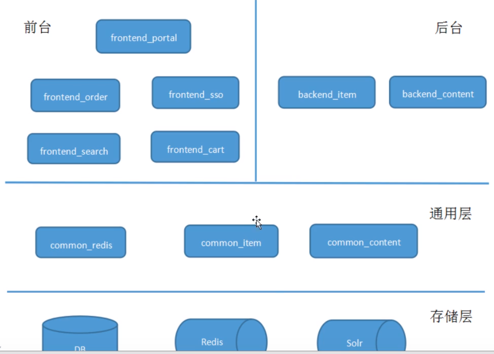

# 百战商城



## 前端
1. 安装node环境
	
	```
	brew install node
	node -v
	npm -v
	```
2. 安装淘宝npm镜像
	
	```
	npm install -g cnpm --registry=https://registry.npm.taobao.org
	```
3. Vue项目
	
	```
	后台系统架构：Vue+VueRouter+axios+element-ui
	前台系统架构：Vue+VueRouter+axios+swiper
	```
4. 前台开发工具
	
	vscode：
		```
		点击扩展，安装vue的插件：vetur
		```
5. 安装依赖		

	```
	cnpm install	#安装依赖
	cnpm install -g concurrently	#安装工具
	npm run dev 	#运行
	```
6. 修改路径和地址
	1. 修改ip：修改vue.config.js文件中，重启前台系统
	2. 修改路径：修改src/api/base.js文件中，不用重启前台系统

## 后台

### 搭建项目
#### 创建注册中心
	
* intellij打包
	* 右侧`Maven Project`，选中需要打包的模块，`install`，

#### [分布式事务TX-LCN](分布式事务管理器.md)

