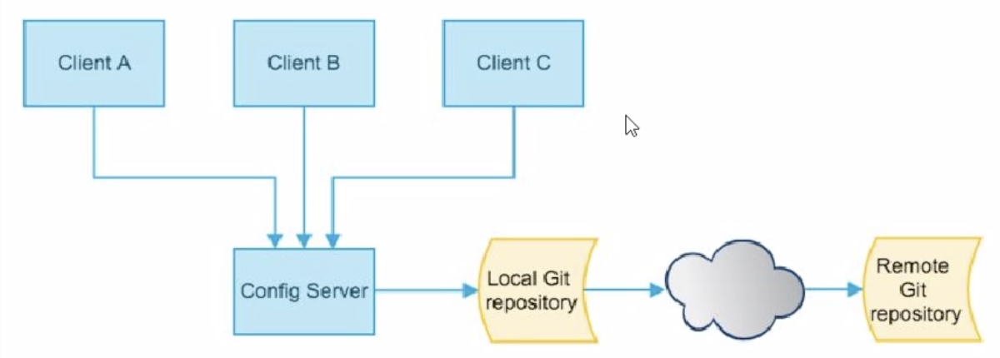

[TOC]


# 一、注册中心

# 二、服务调用

# 三、服务降级

# 四、服务网关

# 五、服务配置

## 5.1 Spring Config

为各个不同的微服务应用提供一个中心化的外部配置


### 5.1.1手动刷新

* **配置中心config同步github**

	1.pmo.xml
	
	```xml
	<!-- config -->
	<dependency>
		<groupId>org.springframework.cloud</groupId>
		<artifactId>spring-cloud-config-server</artifactId>
	</dependency>
	```
	
	2.application.properties
	
	```properties
	# 服务名
	spring.application.name=cloud-common-config
	# 服务端口
	server.port=9000
	# eureka 注册中心地址
	eureka.client.service-url.defaultZone=http://homeUbuntu:8761/eureka
	
	# 配置git服务端地址
	spring.cloud.config.server.git.uri=https://gitlab.com/CLgitlab/bzshop_config.git
	# 分支
	spring.cloud.config.lablel=master
	```
	
	3.主启动类
	
	```java
	@EnableConfigServer #启用config服务
	```
	
	4.测试
	
	```http
	http://127.0.0.1:9020/service/contentCategory/testConfig
	```
	
	5.配置读取规则，配置文件命名需要{application}-{profile}.properties
	
	```http
	/{label}/{application}-{profile}.yml	
	例：http://localhost:9000/master/cloud-common-content-dev.properties
	/{application}-{profile}.yml
	例：http://localhost:9000/cloud-common-content-dev.properties
	/{application}/{profile}/{label}
	例：http://localhost:9000/cloud-common-content/dev/master
	/{application}/{profile}
	例：http://localhost:9000/cloud-common-content/dev
	```
* **其它服务读取配置中心统一配置**
	
	1.pom.xml
	
	```xml
	<!-- config client -->
   <dependency>
		<groupId>org.springframework.cloud</groupId>
		<artifactId>spring-cloud-starter-config</artifactId>
   </dependency>
	```
	2.bootstrap.yml
	
	```properties
	spring.application.name=cloud-common-content
	server.port=9020
	eureka.client.service-url.defaultZone=http://homeUbuntu:8761/eureka
	# 配置从哪获取config
	spring.cloud.config.discovery.enabled=true
	spring.cloud.config.discovery.serviceId=cloud-common-config
	spring.cloud.config.profile=dev
	spring.cloud.config.label=master
	# 暴露监控端点，用于时时刷新
	management.endpoints.web.exposure.include=*
	```
	
	3.在需要获取配置文件的类上添加注解
	
	```java
	@Service
	@RefreshScope   // 配置中心 动态刷新，@RefreshScope会让该bean的参数强制懒加载，会给bean创建代理对象，如果刷新bean，下次访问将会创建一个新的实例，进而重新加载参数
	public class ContentCategoryServiceImpl implements ContentCategoryService {
	
	    @Value("${long1}")
	    private Long long1;
	    
	    ....
	}
	```
	4.测试
	
	```http
	http://127.0.0.1:9020/service/contentCategory/testConfig		# 显示从配置中心获取到的配置信息
	# github中配置文件修改后，配置中心自动获取，客户端服务需要发送post请求到
	curl -X POST "http://127.0.0.1:9020/actuator/refresh" # 刷新配置，才生效
	配合bus实现时时自动更新，其实就是用消息中间件post
	```
	
* **bootstrap.yml 配置文件**

	* application.yml 用户级
	* bootstrap.yml 系统级 优先级**最高**

### 5.1.2半自动刷新


* **利用bus总线，通知客户端半自动更新配置**
	
	* 配置中心
		* pom.xml
		
		```xml
		<!-- config server -->
		<dependency>
			<groupId>org.springframework.cloud</groupId>
  		<artifactId>spring-cloud-config-server</artifactId>
	      </dependency>
		<!--消息总线bus，rabbitmq-->
		<dependency>
			<groupId>org.springframework.cloud</groupId>
			<artifactId>spring-cloud-starter-bus-amqp</artifactId>
  	</dependency>
	  ```
		* application.properties
	
		```properties
		# bus rabbitmq配置
		spring.rabbitmq.host=localhost
		spring.rabbitmq.port=5672
		spring.rabbitmq.username=guest
		spring.rabbitmq.password=guest
		# 暴露bus刷新配置端点
		management.endpoints.web.exposure.include=bus-refresh
		```
		
	* 客户端
		* pmo.xml
		
		```xml
		<!-- config client -->
		<dependency>
			<groupId>org.springframework.cloud</groupId>
			<artifactId>spring-cloud-starter-config</artifactId>
		</dependency>
		<!--消息总线bus，rabbitmq-->
		<dependency>
			<groupId>org.springframework.cloud</groupId>
  		<artifactId>spring-cloud-starter-bus-amqp</artifactId>
  	</dependency>
    ```
       * bootstrap.properties 只能用这个名字，表明是从配置中心读取过来的配置
	  
	     ```properties
		# bus 消息总线 rabbitmq配置
		spring.rabbitmq.host=localhost
		spring.rabbitmq.port=5672
		spring.rabbitmq.username=guest
		spring.rabbitmq.password=guest
		
  	# 暴露监控端点
  	management.endpoints.web.exposure.include=*
	     ```
	  
	* github上更新后，向配置中心发送POST请求，通知全部或部分客户端更新
	
	  ```bash
	  curl -X POST "http://127.0.0.1:9000/actuator/bus-refresh"
	  curl -X POST "http://127.0.0.1:9000/actuator/bus-refresh/cloud-config-client-3366:3366"
	  ```
	

### 5.1.3全自动更新

在版自动更新的基础上，在git远程仓库中配置webhook，一旦有push事件，便回去访问更新url

# 六、服务总线


- spring cloud bus能管理和传播分布式系统间的消息，就像一个分布式执行器，可用于广播状态更改、事件推送等，也可以当作微服务间的通信通道

- **什么是总线bus**
  - 在微服务架构的系统中，通常会使用轻量级的消息代理来构建一个共用的消息主题，并让系统中所有微服务实例都连接上来，由于该主题产生的消息会被所有实例监听和消费，所以称它为消息总线。
  - 在总线上的各个实例，都可以方便地广播一些，需要让其它实例知道的消息
- **基本原理**
  - ConfigClient实例都监听MQ中同一个topic(默认是springCloudBus)，当一个服务刷新数据的时候，它会把这个消息放入到Topic中，这样其它监听同一Topic的服务就能得到通知，然后去更新自身的配置
  - 配置中心启动后，会在rabbitMQ中建立一个Exchange: springCloudBus，每一个服务会有一个对应的Queues绑定到这个交换器

## 6.1使用rabbitMQ做BUS

## 6.2使用Kafka做BUS


